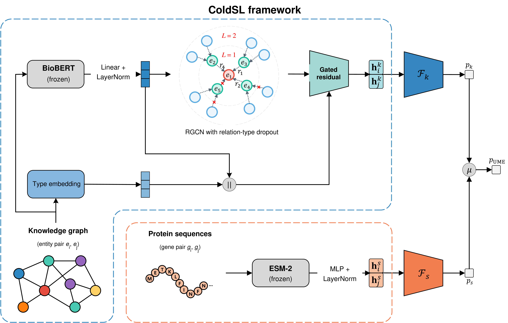

# ColdSL: Cold-Start Synthetic Lethality Prediction via Semantic Knowledge Graphs and Protein Language Models



*Figure 1: Overview of the ColdSL framework.*

## Abstract

ColdSL is a dual-expert framework for synthetic lethality (SL) prediction under a pan-cancer, gene-disjoint cold-start setting. Its knowledge graph expert combines BioBERT-initialized entity representations with an RGCN and gated residual integration, while its protein sequence expert projects frozen ESM-2 representations into a task-specific latent space.

The two experts are trained independently and combined through late fusion. The default ColdSL configuration uses Uni-Modal Ensemble (UME), which averages their predicted probabilities without introducing additional trainable fusion parameters. Under five-fold pan-cancer CV3 evaluation, ColdSL achieved an AUROC of 0.7750, an AUPR of 0.7993, and an F1 score of 0.7356.

## Installation

ColdSL should be run in a Conda environment. Python 3.11 is recommended.

### 1. Create Environment

```bash
conda create -n ColdSL python=3.11
conda activate ColdSL
```

### 2. Install PyTorch

Install the PyTorch build that matches your CUDA version. For example, for CUDA 12.4:

```bash
pip install torch==2.4.0 torchvision==0.19.0 torchaudio==2.4.0 \
  --index-url https://download.pytorch.org/whl/cu124
```

### 3. Install Other Dependencies

```bash
pip install accelerate==0.34.2 numpy pandas matplotlib tqdm \
  scikit-learn biopython transformers torch-geometric jupyter
```

## Data Preparation

### TL;DR

To skip preprocessing, download the packaged pan-cancer CV3 data [`data.tar.gz`](https://drive.google.com/file/d/1tgc-Nzg5yppCTllWF-dDNIv5WQNUh_GX/view?usp=drive_link) from Google Drive and extract it in the ColdSL project root. The archive contains the processed features and five CV3 folds under `data/pan/`.

SHA-256:

```text
eee47a1f413f1360259af770317d2566967c2bc3f9ca9b8cbb1c3f4e185eeec5
```

For example:

```bash
tar -xzf data.tar.gz
```

The expected directory structure is:

```text
ColdSL/
├── data/                       # Generated features and CV splits
├── data_raw/
│   ├── ELISL/                 # train_pairs.csv, test_pairs.csv
│   ├── SLKG2/                 # SL labels and biomedical KG
│   ├── TCGA/pan/              # cna.txt, exp.txt, mut.txt
│   ├── uniprot/               # Reviewed human protein sequences
│   ├── biobert-v1.1/          # Local BioBERT model
│   └── esm2_t33_650M_UR50D/   # Local ESM-2 model
├── result/                     # Checkpoints, logs, and metrics
├── misc/
└── src/
```

Prepare the following resources:

1. Download `train_pairs.csv` and `test_pairs.csv` from the [ELISL dataset](https://figshare.com/articles/dataset/ELISL_Datasets/23607558) and place them in `data_raw/ELISL/`.
2. Download `Human_SL.csv`, `Human_nonSL.csv`, `Human_SR.csv`, and `sldb_complete.csv` from [SynLethDB 2.0](https://www.synlethdb.com/v2/) and place them in `data_raw/SLKG2/`.
3. Download reviewed human protein sequences from [UniProt](https://www.uniprot.org/uniprotkb?facets=reviewed%3Atrue&query=organism_id%3A9606) in canonical FASTA format and place the file in `data_raw/uniprot/`.
4. Download pan-cancer CNA, mutation, and gene-expression profiles from [cBioPortal](https://www.cbioportal.org/study/summary?id=pancan_pcawg_2020), rename them to `cna.txt`, `mut.txt`, and `exp.txt`, and place them in `data_raw/TCGA/pan/`. These profiles are used only to define and align the candidate-gene universe; they are not model inputs.
5. Download [BioBERT v1.1](https://huggingface.co/dmis-lab/biobert-v1.1) and [ESM-2 650M](https://huggingface.co/facebook/esm2_t33_650M_UR50D) to the corresponding directories shown above.

## Data Preprocessing

> [!IMPORTANT]
> Run all preprocessing and training commands from the `src` directory because the scripts use relative paths.

```bash
cd src
```

### Step 1: Generate SL Labels and Convert the Knowledge Graph

```bash
python preprocess_pre.py
```

### Step 2: Build the Aligned Pan-Cancer Dataset

```bash
python preprocess_main.py \
  --ct pan \
  --cn_kg TOTAL \
  --omics_types cna exp mut
```

### Step 3: Generate Five-Fold CV3 Splits

```bash
python preprocess_folder.py --ct pan
```

### Step 4: Generate Entity and Protein Representations

Run all cells in `preprocess_entity.ipynb`, then execute:

```bash
python biobert2.py
python esm2.py
```

The generated BioBERT and ESM-2 representations are saved under `data/pan/`.

## Training & Evaluation

Before training, edit `accelerate_config.yaml` so that `num_processes` and `gpu_ids` match your hardware. The following commands reproduce fold 1 of the pan-cancer CV3 experiment; use `--train_fold 1` through `5` for all folds.

### 1. Train the Knowledge Graph Expert

```bash
accelerate launch --config_file ../accelerate_config.yaml train.py \
  --task_type only_kg \
  --cancer_type pan \
  --metric 3 \
  --train_fold 1 \
  --epochs 30 \
  --kg_experiment C \
  --p_rel 0.3 \
  --kg_biobert_fusion_type 3 \
  --kg_node_type_emb_dim 32 \
  --biobert_embedding_path ../data/pan/E_biobert.npy \
  --specify_result_saving_folder coldsl_only_kg_pan_cv3_fold1
```

### 2. Train the Protein Sequence Expert

```bash
accelerate launch --config_file ../accelerate_config.yaml train.py \
  --task_type only_seq \
  --cancer_type pan \
  --metric 3 \
  --train_fold 1 \
  --epochs 30 \
  --seq_embedding_path ../data/pan/E_esm2_600.npy \
  --seq_encoder_mlp_dropout 0.3 \
  --specify_result_saving_folder coldsl_only_seq_pan_cv3_fold1
```

### 3. Evaluate ColdSL with UME

`--omics_ckpt_path` is a legacy argument name and refers to the sequence-expert checkpoint in the current implementation.

```bash
accelerate launch --config_file ../accelerate_config.yaml train.py \
  --task_type ume \
  --cancer_type pan \
  --metric 3 \
  --train_fold 1 \
  --epochs 1 \
  --omics_ckpt_path ../result/coldsl_only_seq_pan_cv3_fold1/checkpoint.pth \
  --kg_ckpt_path ../result/coldsl_only_kg_pan_cv3_fold1/checkpoint.pth \
  --specify_result_saving_folder coldsl_ume_pan_cv3_fold1
```

Each run saves its configuration, metrics, training curve, and selected checkpoint under `result/<run_name>/`. The helper script `jmpax.py` can aggregate results across the five folds after its result prefix is configured.
